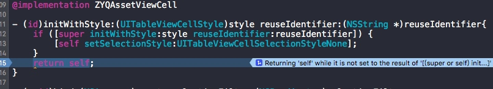
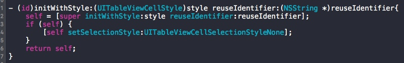
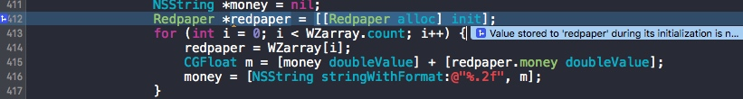
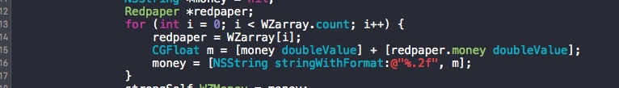
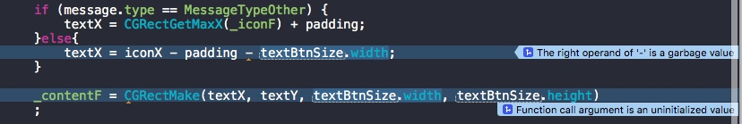
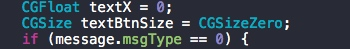
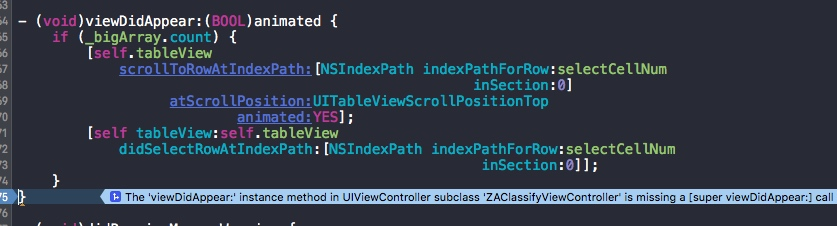

# Analyze问题解决

##第一种错误提示:

```
analyze instance variable used while 'self' is not set to the result of '[(super or self) init...]
```

解决办法,用到[super init]的地方都换成self
例如:


修改成

这样就不会提示了


##第二种错误提示
```
Value stored to "xxx"is never read
```
主要就是说这个变量你没有使用

例如:


解决办法:


##第三种种错误提示
类似的,垃圾值

```
The right operand of '-' is a garbage value
```

添加初始值就可以了



##第四种错误提示
没有调用super



