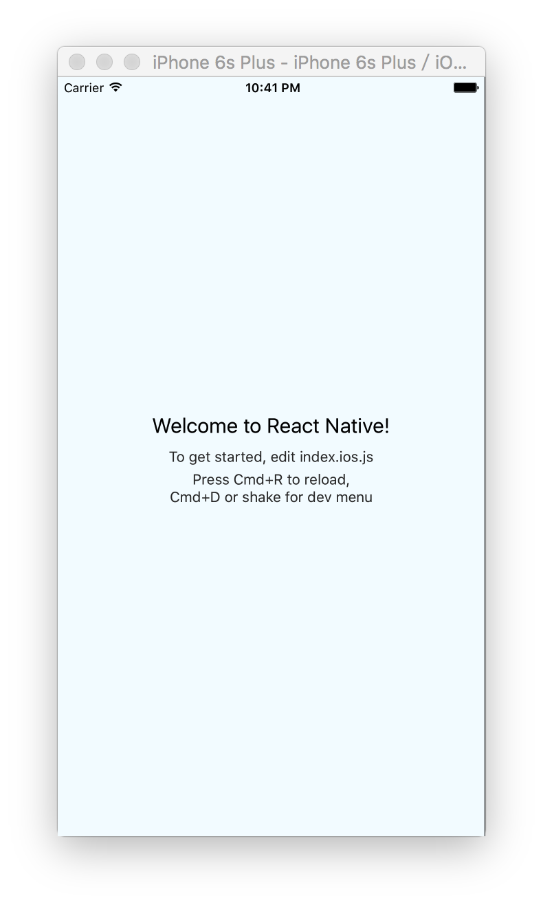
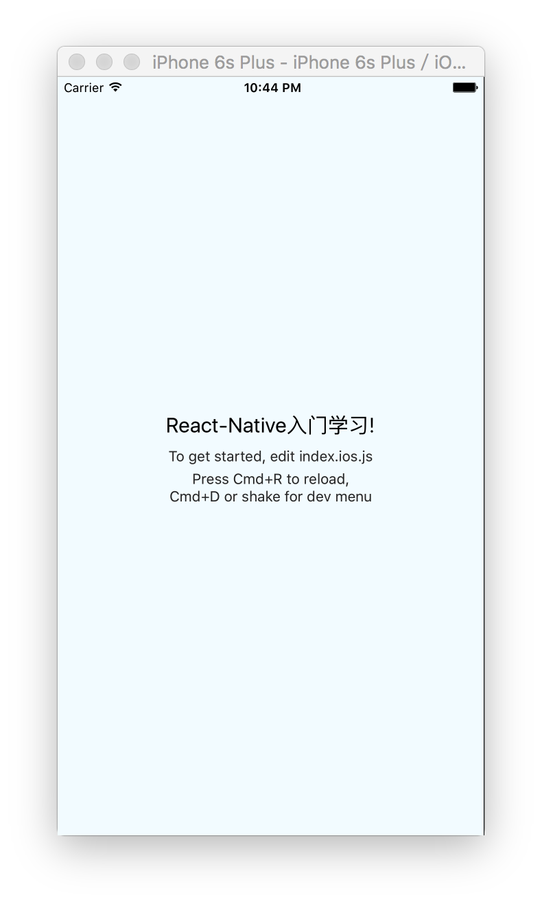
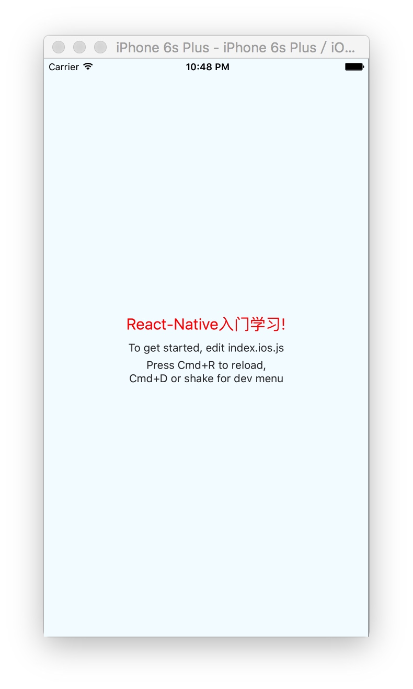
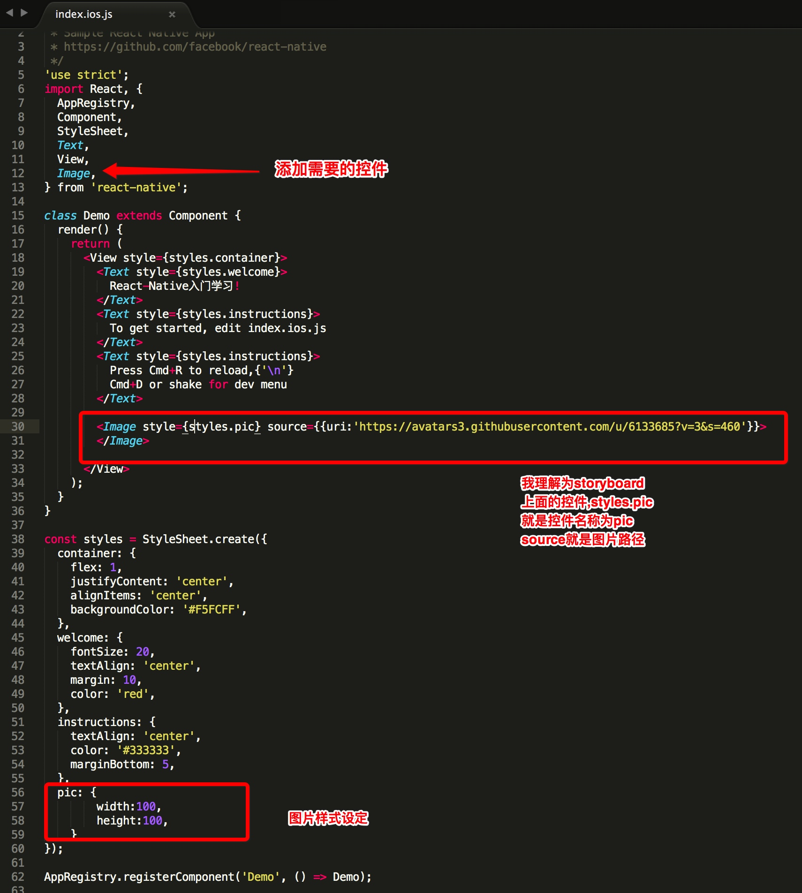
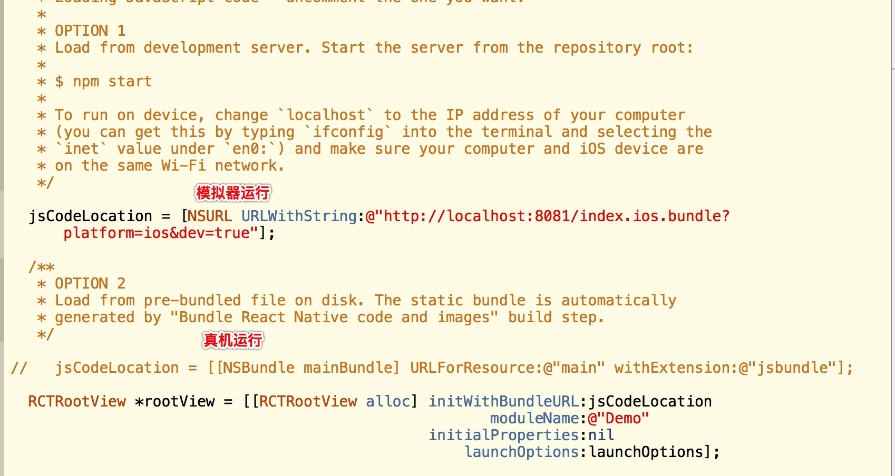

# React-Native学习笔记
> 参考资料:[React Native 入门与实战](https://book.douban.com/subject/26694486/)


#环境搭建
默认已经Xcode安装,然后还需要
1. 安装node.js 可以下载安装[node.js](https://nodejs.org/download/) 也可以```brew install node```
2. 建议安装watchman(目前作用还不清楚,先安装),```brew install watchman```
3. 安装flow：```brew install flow```

好了,环境配置好了.

#创建项目
1. 安装命令行工具```sudo npm install -g react-native-cli```
2. cd到自己想创建项目的目录,然后创建创建项目:```react-native init HelloWorld```
3. 找到目录,运行.xcodeproj

如果关闭命令行后,想再次启动该项目,可以cd到项目目录,然后在命令行中```npm start```
运行的效果


#修改项目
打开index.ios.js,这个是Rect-Native JS开发的入口文件.
找到

```
<Text style={styles.welcome}>
		 Welcome to React Native!
</Text>
```

修改为:

```
<Text style={styles.welcome}>
      React-Native入门学习
</Text>

```
效果如下:


找到

```
welcome: {
    fontSize: 20,
    textAlign: 'center',
    margin: 10,
},
```
如果熟悉原生开发或者熟悉HTML开发的一看就清楚这些属性是干嘛的.
这时我们可以设置字体的颜色为红色

```
welcome: {
    fontSize: 20,
    textAlign: 'center',
    margin: 10,
    color: 'red',
},
```

效果:

颜色已经改变了.

#开始尝试修改项目代码

```
import React, {
  AppRegistry,
  Component,
  StyleSheet,
  Text,
  View,
} from 'react-native';

```
这部分就是批量定义组件,把项目中需要的组件都在这里定义

比如我想在项目中添加一个Image,这时,我首先需要在这里添加Image
然后



#关于Command +R 
这里不是指Xcode中运行,而是模拟器调试,需要在Simulator中设置键盘为物理键盘

#关于在真机运行
如果真机运行必须切换,否则失败


