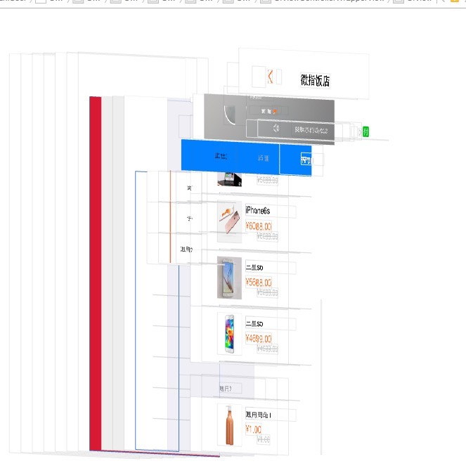
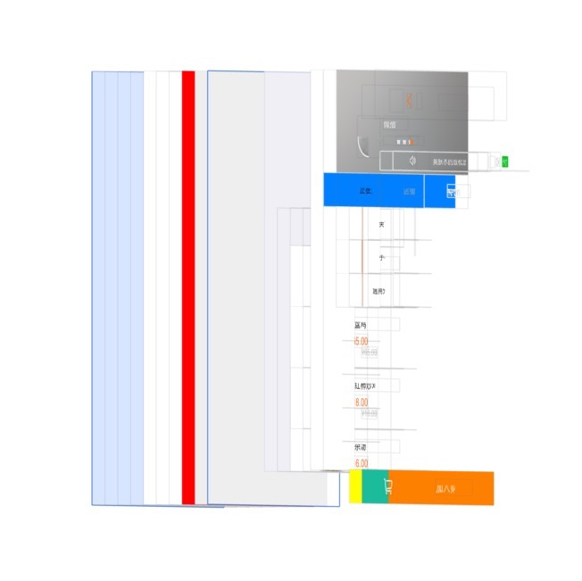

# 与导航栏相关的问题
> 商户详情界面会更高导航栏的透明度，在其他界面如果包含下面的情况就会出现问题：

注意渲染视图的起始位置。

上面这张图从导航栏下面开始渲染


这张图从顶部开始渲染

　
**原因：**scrollView是控制器的第一个子视图,这时候可能出现上面的情况，如果更改了导航栏的透明度必现。
**解决办法：**
1. 外面再嵌套一个视图
2. 设置导航栏的透明属性。
3. 所有涉及到的视图都继承自一个跟控制器，然后在跟控制器中设置即将显示与即将消失时候导航栏的样式

```
self.navigationController.navigationBar.translucent = YES;
```

商户详情界面的修改方式，为了不让详情界面过多的干涉到其他页面，我们这里采用了自定义视图模拟导航栏，这样可以避免涉及到其他页面。

**涉及到商户详情界面的视图控制器有：**
附近商户列表   RPPNearByViewController
搜索商户结果列表  RPPSearchShopResultViewController
商超内商户列表  WZSupermarketViewController
商品详情页面  RPPProductDetailViewController
特价详情页面  LYQCouponDetailViewController
购物车   LYQShopCartController
参与买送商户列表  RPParticipatingMerchantsViewController
3小时团订单  JZLCouponCodeViewController
消费后付款订单  XZAfterPayViewController
商户红包详情页  LYQRedPacketController


##其他问题：
找到视图的父控制器
监听子控制器的tableView后如何移除
循环引用问题-->视图的生命周期-->调试技巧viewWillDisAppear

