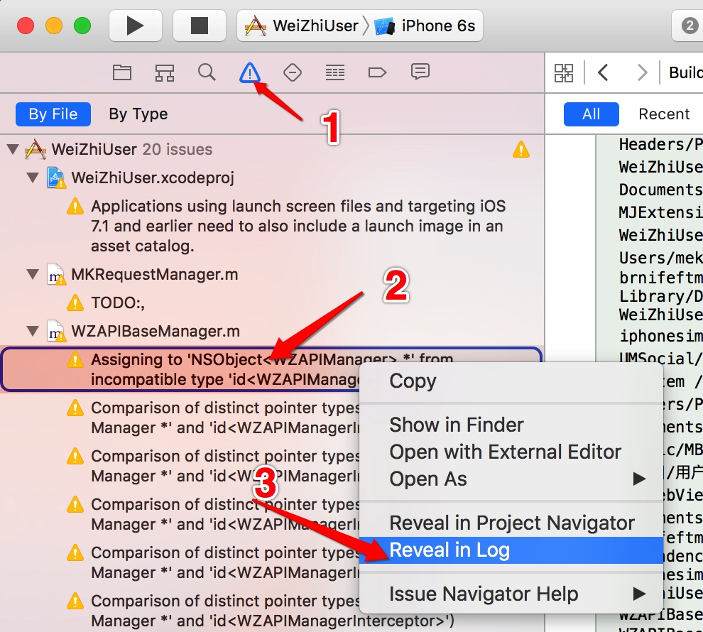
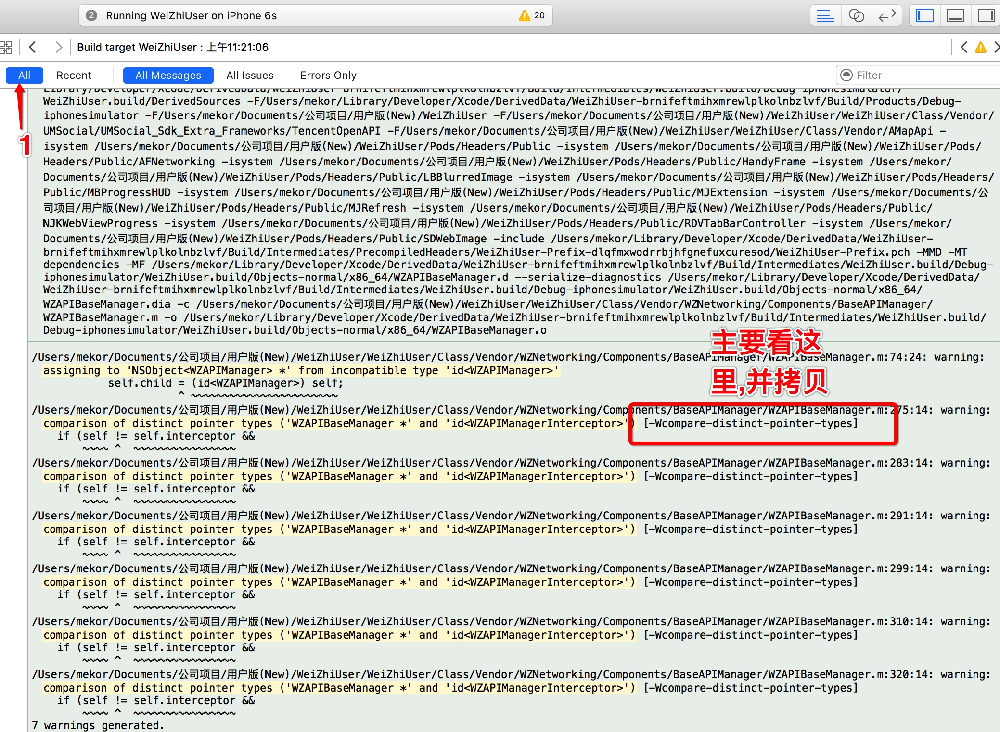
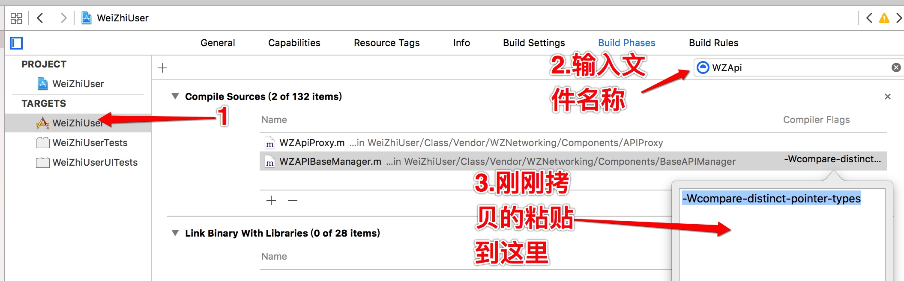
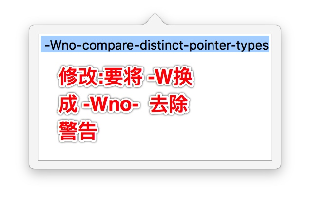
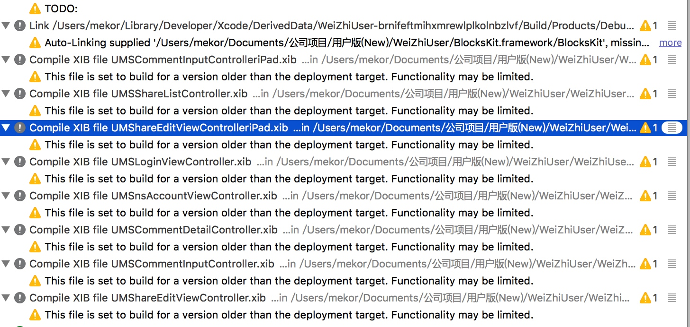
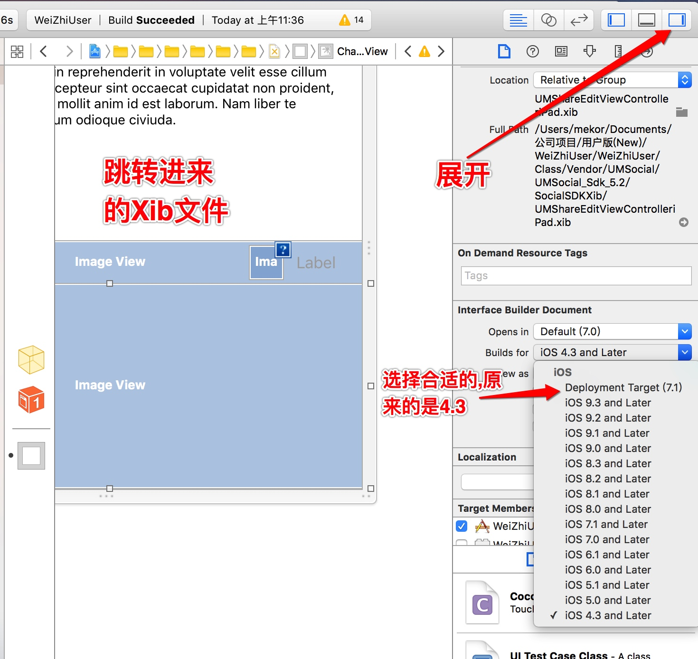
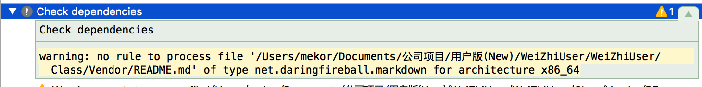
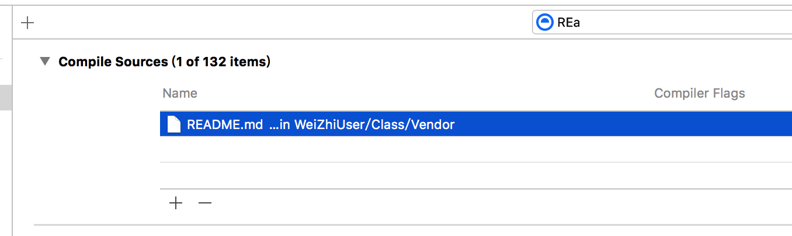

#忽略编译器警告
## 第一种方法
举例


接下来,



## 第二种方法
```
#pragma clang diagnostic push
#pragma clang diagnostic ignored" -Wcompare-distinct-pointer-types"
    //写在这个中间的代码,都不会被编译器提示-Wcompare-distinct-pointer-types
#pragma clang diagnostic pop 
```

##Xib警告: This file is set to build for a version older than the deployment target. Functionality may be limited.
类似于这种



双击进入Xib文件

OK,这样就没有警告了

##非源文件参与编译错误

项目中有一个README.md的文件,这个文件主要记录使用第三方的一些情况,默认就参与编译了,我们需要这样做



找到这个文件,然后移除,这样就不会有问题了.
参考: [compilation warning: no rule to process file for architecture i386](http://stackoverflow.com/questions/6509600/compilation-warning-no-rule-to-process-file-for-architecture-i386)

