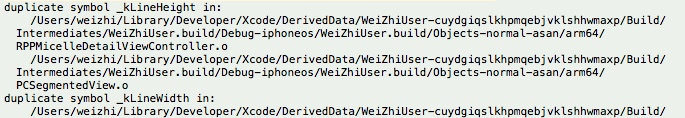

# 重复引用

重复定义 _kLineHeight
错误格式
duplicate symbol _kLineHeight in:
/Users/weizhi/Library/Developer/Xcode/DerivedData/WeiZhiUser-cuydgiqslkhpmqebjvklshhwmaxp/Build/Intermediates/WeiZhiUser.build/Debug-iphoneos/WeiZhiUser.build/Objects-normal-asan/arm64/RPPMicelleDetailViewController.o
......
ld: 5 duplicate symbols for architecture arm64
clang: error: linker command failed with exit code 1 (use -v to see invocation)

