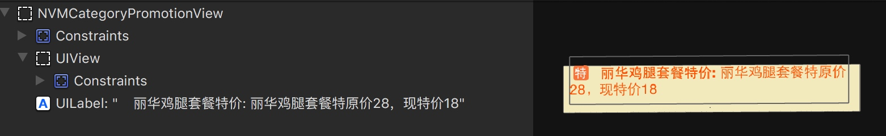

# 饿了么详情页分析

分三层:
最底层:ViewController

上面包括背景视图:
1. NVMRestaurantBackgroundView(灰色部分,显示头像,名称,费用,和优惠等)
2. NVMRestaurantPromotionView(广播)
3. View

#NVMRestaurantBackgroundView

#NVMRestaurantPromotionView

#View

View上面包含NVMSegmentView&NVMPanGestureScrollView.
NVMSegmentView 由3个button和一个View组成
NVMPanGestureScrollView包含3个View我猜测这3个View应该是由3各对应的控制器控制的.

##其中商品对应的UIView布局
###NVMFoodCategoryTableView
1. 颜色:

2. NVMCategoryInfoCell的组成

当选中的cell会有一个imageView

###NVMFoodListTableView
1. NVMFoodListSectionHeaderView

NVMCategoryPromotionView 包含

"特"不是一张专门的图片而是跟文本同属label

###NVMFoodCell

NVMFoodToolBar

当如果在销售,即不显示"已售完"则点击加号按钮会显示减号按钮和数量label,左侧NVMCategoryInfoCell对应的NVMIconNumberView会显示相应的数量

点击加号按钮之后

